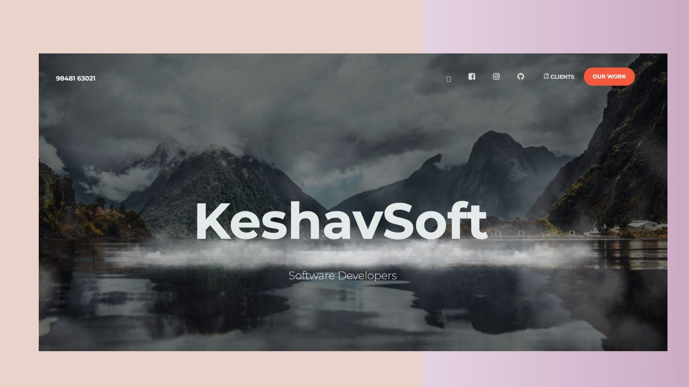

<h1 align="center" style="color: #0000FF;">crudGenByPath</h1>

[](https://keshavsoft.com/)

## **Table of Contents** 📚
- [Overview](#overview)
- [Installation](#installation)
  - [Cloning the Repository](#cloning-the-repository)
  - [Setting Environment Variables](#setting-environment-variables)
  - [Running the Project](#running-the-project)
- [Folder Structure](#folder-structure)
- [Purpose of the Project](#purpose-of-the-project)
- [Important Points](#important-points)

## **Overview** 🔎
This project focuses on automating CRUD operations for JSON files, making it easy to manage and manipulate data. It offers a user-friendly interface for performing essential actions on JSON files, such as creating, reading, updating, and deleting records.

#### **Key Features**
- **Dynamic Schema Handling:** Define table schemas using JSON files and dynamically generate CRUD operations.
- **Cross-Platform Compatibility:** Compatible with Windows, Mac, and Linux operating systems.
- **Effortless Setup:** Use provided batch files for Windows or simple commands for other OS to set up the project quickly.
- **Secure Storage:** Utilizes SQLite for data storage with a configurable password (KS_SQLITE_PASSWORD=9848163021).
- **Automatic Frontend Setup:** Automatically creates a frontend codebase in the public/JsonCRUD directory.

#### **Technologies Used**
- **Node.js:** Leveraging the power of JavaScript on the server-side.
- **Express.js:** A minimal and flexible Node.js web application framework for building robust APIs.
- **SQLite:** A lightweight, file-based database for efficient data storage.
- **npm:** The package manager for Node.js used for installing project dependencies.


## **Installation** 🚀

1. Create a folder and navigate into it using the command prompt.

2. Clone the repository
   ```
   
   git clone https://github.com/keshavsoft/crudGenByPath.git
   
   ```
3. Change Directory to crudGenByPath or Open the cloned folder, navigate to crudGenByPath, and open the command prompt.
   ```
   
    cd crudGenByPath
   
   ```

4. Create a .env file in the root directory and add the following
   ```
   
   KS_SQLITE_PASSWORD=9848163021
   
   ```
5. Run the batch file (For Windows)
   ```
   
   BoilerPlate.bat
   
   ```
   This Above Command runs the following in Windows
   ``
   npm i and node KCode/EntryFile.js
   ``
   
    For Mac or Linux:
      ``
        chmod +x boilerplate.sh and sh boilerplate.sh
     ``
   
 7. For Executing
   
   ```
   
      npm run start
   
   ```
## **Folder Structure**

```plaintext
├── KCode/
│   └── EntryFile.js
├── public/
│   └── JsonCRUD/
│       └── bin/
│           └── (frontend code)
├── KData/
│   └── JSON/
│       └── 316/
│           └── data.db
├── FromTableColumns/
│   └── customers.json
├── FromData/
│   └── (JSON files)
├── bin/
│   └── (backend code)
├── BoilerPlate.bat
├── boilerplate.sh
├── package.json
├── .env
└── README.md
```
## **Purpose of the Project** 🎯
The primary objective is to simplify the process of managing and interacting with JSON files. By automating CRUD operations, this project aims to enhance efficiency and reduce the complexity of handling JSON data.
## **Important Points** 
Date: 24 Jan 2024
Stopped using encrypted SQLite database due to the unavailability of npm modules and limited knowledge within the team.


